 

 

### Mobile Application Developer · Product-minded Builder

Building practical digital products with **Flutter**, **product thinking**, and **AI-assisted development**.

 

 

## About

I’m **Parsa Shafizade**, a Mobile Application Developer focused on building practical digital products with **Flutter**, **product thinking**, and **AI-assisted development**.

I’m interested in the full path from understanding a problem to designing, building, testing, and continuously improving the software behind it.

 

 

## What I'm focused on

 

- **Mobile Development** — building reliable cross-platform applications with Flutter and strengthening the engineering foundations behind them.
- **Product Development** — connecting technical decisions with real user needs, usability, and practical product value.
- **AI-assisted Development** — using AI to improve exploration, implementation, debugging, reasoning, and development workflows.
- **Continuous Improvement** — refining architecture, software design, technical judgment, and the way products are built over time.

 

 

## Future Project

 

 

## Selected Work

Recent projects that reflect what I’m currently building, exploring, and improving.

 

 

 

## Tech Stack

### Mobile Development

  

**Flutter** · **Dart** · **Cross-Platform Development** · **Mobile Application Development**

 

### Programming Languages

 

### Design & Tools

 

### AI & Technology Interests

<table>
<tr>

<td width="33%" valign="top">

<strong>AI Systems</strong>

  

AI Agents  
Generative AI

</td>

<td width="33%" valign="top">

<strong>Development</strong>

  

AI-assisted Development  
Automation Workflows

</td>

<td width="33%" valign="top">

<strong>Product</strong>

  

AI in Product Development  
Product Thinking

</td>

</tr>
</table>

 

 

## How I approach building products

<table>
<tr>

<td width="25%" valign="top">

<strong>01 · Understand</strong>

  

Understand the problem, user need, and constraints before choosing the solution.

</td>

<td width="25%" valign="top">

<strong>02 · Decide</strong>

  

Turn product requirements into deliberate technical and product decisions.

</td>

<td width="25%" valign="top">

<strong>03 · Build</strong>

  

Translate those decisions into practical, maintainable working software.

</td>

<td width="25%" valign="top">

<strong>04 · Improve</strong>

  

Test, learn, iterate, and make both the product and engineering stronger.

</td>

</tr>
</table>

 

 

## GitHub Activity

 

 

 

## Background

Computer Engineering student at **Bu-Ali Sina University**

  

**Software Engineering** · **Artificial Intelligence** · **Computer Networks** · **Databases** · **Algorithms & Data Structures**

 

I’m working toward becoming a stronger **Mobile / Software Engineer** who understands both the engineering system and the product it exists to serve.

 

 

## Connect

&nbsp;

 

Building, learning, and improving one product at a time.

